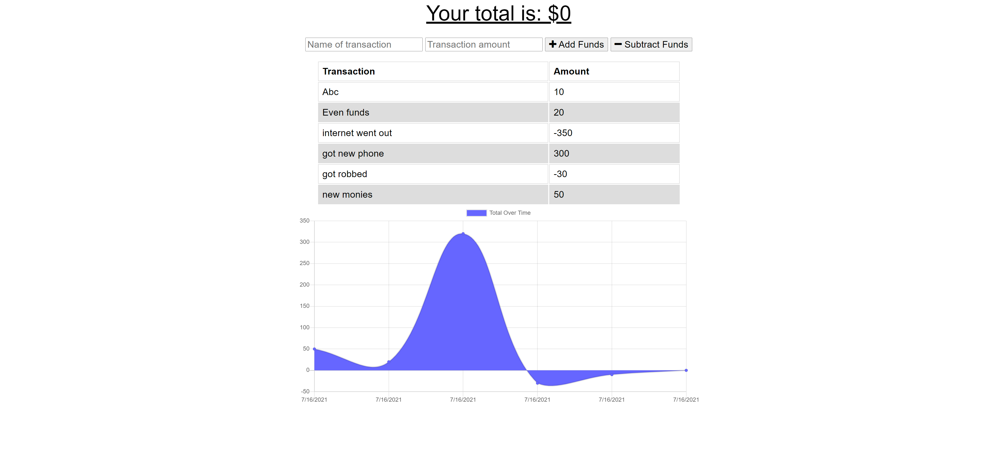

# Budget Tracker

## Description

budget tracker is a PWA that can track online and offline transactions

## Table of Contents

- [Contributing](#contributing)
- [Links](#links)
- [Questions](#questions)
- [License](#license)
- [Author](#author)

## Contributing
- Study group - Robert Schwarts, Joseph Bryant, Nathan da Silva.

Cody Hebert, anyone else who wants to work on this go ahead and clone this.

## Links

https://floating-brushlands-08154.herokuapp.com/

## Questions

If you have any questions feel free to either email me the question:

- My email: cdhebert2@gmail.com

## License

## Author

Cody Hebert